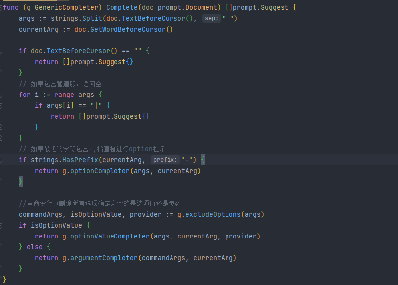

## 开发语言

Golang

## 工具特性

**静态指令自动补全功能**
MOON-CLI支持官方原版客户端的所有指令、参数，并对指令和参数选项提供有自动补全与提示功能。其中大部分指令的介绍提示来源于以下官方参考文档：https://docs.docker.com/engine/reference/commandline/cli/

**动态上下文数据的智能感知**

除了静态的指令提示外，MOON-CLI还能对当前环境中的动态数据进行感知。譬如Docker中的容器和镜像名称、运行状态；还有端口号、操作系统的文件目录信息进行提示和自动补全。目前支持的动态数据包括有：

- Docker：

  - 镜像名称及状态信息
  - 容器名称及状态信息
  - 内部信息，如：容器暴露的端口号、文件路径等的提示

  

**交互式的批量操作**

为方便同时管理多项资源，MOON-CLI提供了交互式的CUI操作，支持单选、复选、快速过滤等功能，以满足一次性对多个资源进行同类操作。

## 实现思路

该工具主要基于go-prompt以及survey开源组件实现

go-prompt：一款用于构建强大的交互式命令行应用程序的库。
survey：用于在支持 ANSI 转义序列的终端上构建交互式和可访问的提示。

1. **容器环境发现：通过官方提供的客户端SDK进行环境发现**

   

2. **自动提示及补全元数据**

argument类型元数据：

options类型元数据：

其中Provider是用于提供智能感知的关键配置，例如Provider：“container”，会自动进行现有容器环境的补全提示。

3. **定义提示信息的Provider**

现工具提供以下几类提示信息Provider类型

1. Path类型：提供系统文件路径补全（使用filePath包提供数据支持）。
2. Argument类型：提供docker参数的提示补全（使用Argument元数据提供数据支持）。
3. Option类型：提供docker参数选型的提示补全（使用Options元数据提供数据支持）。
4. Image类型：提供环境内Image的提示补全（使用docker SDK提供数据支持）。
5. RemoteImage类型：提供docker hub的Image的提示补全（使用docker SDK提供数据支持）。
6. Container类型：提供环境内Container的提示补全（使用 docker SDK提供数据支持）。
7. Port类型：根据环境内的image定义的ExposedPorts进行提示补全（使用 docker SDK提供数据支持）。

4. 定义公用的补全提示核心对比函数

